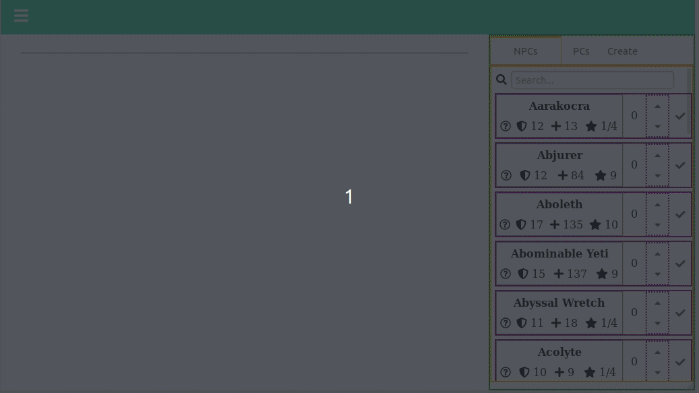

# table-top-encounter
This is a simple initiative tracker for Dungeons and Dragons.

### Purpose & Goals
Helping game masters track initiative order in turn based table-top role-playing games, mainly targeted toward DnD games. 
Game masters should be able to create player characters, monsters and non-player characters.

Initiative order should be easily sortable (with drag and drop items).

The app should offer the ability of preparing encounters for the future and loading them when necessary.

### Work in progress
I keep screencaps in doc/progress_pics to help me track design changes.

#### Current phase
- basic functionality development
- design not thought out -- all UI/UX components are just placeholders waiting to be properly designed and programmed

#### Built with React.js
